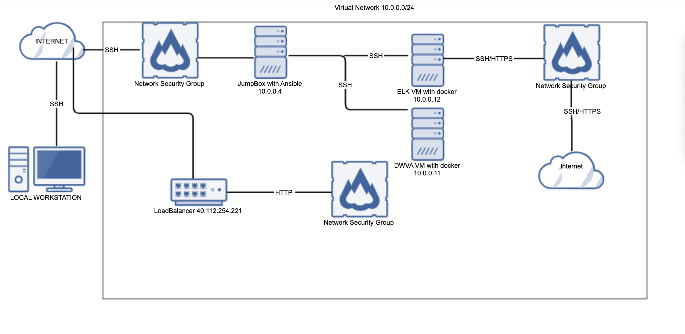

# CloudProject
## Automated ELK Stack Deployment

The files in this repository were used to configure the network depicted below.

These files have been tested and used to generate a live ELK deployment on Azure. They can be used to either recreate the entire deployment pictured above. Alternatively, select portions of the configuration file may be used to install only certain pieces of it, such as Filebeat. 

This document contains the following details:
- Description of the Topologu
- Access Policies
- ELK Configuration
  - Beats in Use
  - Machines Being Monitored
- How to Use the Ansible Build

### Description of the Topology

The main purpose of this network is to expose a load-balanced and monitored instance of DVWA, the D*mn Vulnerable Web Application.

Load balancing ensures that the application will be highly redundant, in addition to restricting access to the network.
- Load balancers protect the avaiability of a service or website, ensuring that denial of service attacks will not bring it down. The advanatge of a jumpbox is that it allows you to configure an entire network in a hardend enviroment separate from the internet until it is ready to come online.

Integrating an ELK server allows users to easily monitor the vulnerable VMs for changes to the files and system logs.
- _TODO: What does Filebeat watch for?_ Filesbeat watches out to changes to logs and notes any changes between old logs and a new logs
- _TODO: What does Metricbeat record?_Metricbeat records the statistics from the system and services running on the vulnerable VMs and outputs it in whichever way you specify. 

The configuration details of each machine may be found below.
_Note: Use the [Markdown Table Generator](http://www.tablesgenerator.com/markdown_tables) to add/remove values from the table_.

| Name     | Function | IP Address | Operating System |
|----------|----------|------------|------------------|
| Jump Box | Gateway  | 10.0.0.4   | Linux            |
| DVWA 1   |Webservers| 10.0.0.11  | Linux            |
| ElkServer| Elkserver| 10.0.0.12  | Linux            |

### Access Policies

The machines on the internal network are not exposed to the public Internet. 

Only the Jumpbox machine can accept connections from the Internet. Access to this machine is only allowed from the following IP addresses:
- 184.164.0.0 
*I have masked my last IP ocets due to this being avaibale publically*
Machines within the network can only be accessed by Jumpbox (10.0.0.4)

A summary of the access policies in place can be found in the table below.

| Name      | Publicly Accessible | Allowed IP Addresses |
|-----------|---------------------|----------------------|
| Jump Box  | Yes                 | 184.164.0.0          |
| DVWA      | Yes:80              | Internet             |
| Elk Server|  Yes:5601           | Internet             |

### Elk Configuration

Ansible was used to automate configuration of the ELK machine. No configuration was performed manually, which is advantageous because...
- it is much faster and scales well in an enterprise environment versus manually configuring a machine which requires procedural steps. Ansible lets us be declarative and change states quickly.

The playbook implements the following tasks:
- Install Docker.io 
- Install Python
- Install Docker module
- Increase virtual memory
- Download and launch Elk docker container with the following published ports 5601,9200 and 5044

The following screenshot displays the result of running `docker ps` after successfully configuring the ELK instance.

### Target Machines & Beats
This ELK server is configured to monitor the following machines:
- DVWA Machine @10.0.0.11

We have installed the following Beats on these machines:
- FileBeat and MetricBeat

These Beats allow us to collect the following information from each machine:
- `Filebeat` collects log data, it then compares old logs and new logs to see any new information, it then aggreates this data so users can monitor changes to the  system. 
`Metricbeat` collects service data, it gathers metrics and statisitics for each service running on the servers which allows users to track whether or not services are working as intended or if foul play is occuring. 
### Using the Playbook
In order to use the playbook, you will need to have an Ansible control node already configured. Assuming you have such a control node provisioned: 

SSH into the control node and follow the steps below:
- Copy the install-elk.yml file to the ansible playbook directory /etc/ansible/roles
- Update the hosts file in /etc/ansible/ to include the the IP of the Elk Server 10.0.0.12 under *elk servers*
- Run the playbook using the command ansible-playbook install-elk.yml, navigate to the public IP of the Elk server using port 5601, 104.42.180.47:5601  to check that the installation worked as expected. You should see Kibana appear below as shown below

## Installing Filebeat and MetricBeat
- Copy both the beats playbook.yml files and the associated configuration files to the ansible directory /etc/ansible/files
- Update the hosts file in /etc/ansible/ to include the the IP of the DWVA Machine 10.0.0.11 under *elk servers*
- Run both the playbooks using the command ansible-playbook insert_beat-playbook.yml. Successfully run playbooks will look as shown below
  
-
-
-
